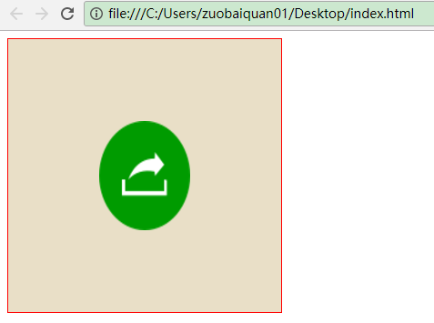
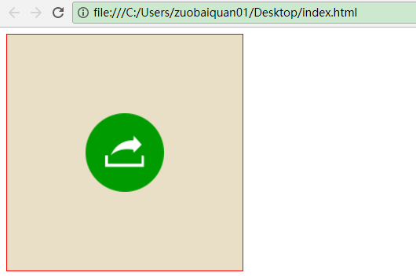
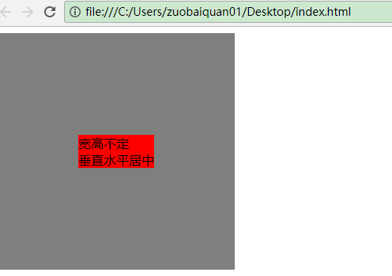

### **1.水平居中的 margin:0 auto;**

这个是用于子元素上的，前提是不受float影响

```html
<style type="text/css">
.box{
	width: 300px;
	height: 300px;
	border: 3px solid red;
	/*text-align: center;*/
}	
img{
	display: block;
	width: 100px;
	height: 100px;
	margin: 0 auto;
}
</style>
<body>
  <div class="box">
        
  </div>
</body>
```


### **2.水平居中 text-align:center;**

代码实例如上

### **3.水平垂直居中（一）定位和需要定位的元素的margin减去宽高的一半**

```html
<style type="text/css">
   .box{
        width: 300px;
        height: 300px;
        background:#e9dfc7; 
        border:1px solid red;
        position: relative;
    }
    img{
        width: 100px;
        height: 120px;
        position: absolute;
        top: 50%;
        left: 50%;
        margin-top: -60px;
        margin-left: -50px;
    }
</style>
<div class="box">
   
</div>
```


### **4.水平垂直居中（二）定位和margin:auto;**

这个方法也很实用，不用受到宽高的限制,也很好用

```css
.box{
  position: relative;
  width: 300px;
  height: 300px;
  background:#e9dfc7; 
  border:1px solid red;
}
img{
  width: 100px;
  height: 100px;
  position: absolute;
  top: 0;
  left: 0;
  right: 0;
  bottom: 0;
  margin: auto;
}
```


### **5.水平垂直居中（三）绝对定位和transfrom**

这个方法比较高级了，用到了形变，据我所知很多大神喜欢使用这个方法进行定位，逼格很高的，学会后面试一定要用！这个是不需要知道居中元素的宽高就可以使用的，代码里的图片稍微有点大，改改宽高，仅此而已，在面试中大部分人会问如果**不知道宽高该如何居中**，答这个，加分！

```css
.box{
  width: 300px;
  height: 300px;
  background:#e9dfc7; 
  border:1px solid red;
  position: relative;	
}
img{
  width: 100px;
  height: 100px;
  position: absolute;
  top: 50%;
  left: 50%;
  transform: translate(-50%,-50%);
}
```

### **6.水平垂直居中（四）diplay：table-cell**

其实这个就是把其变成表格样式，再利用表格的样式来进行居中，很方便

```css
 .box{
   width: 300px;
   height: 300px;
   background:#e9dfc7; 
   border:1px solid red;
   display: table-cell;
   vertical-align: middle;
   text-align: center;
 }
 img{
   width: 100px;
   height: 100px;
   /*margin: 0 auto;*/  这个也行
 }
```

### **7.水平垂直居中（五）flexBox居中**

这个用了CSS3新特性flex,非常方便快捷，在移动端使用完美，pc端有兼容性问题，以后会成为主流的

```css
.box{
  width: 300px;
  height: 300px;
  background:#e9dfc7; 
  border:1px solid red;
  display: flex;
  justify-content: center;
  align-items:center;
}
img{
  width: 100px;
  height: 100px;
}
```

### **8.水平垂直居中（六）利用vertical-align:middle;**

这方法不常见，但是这位朋友[@不二很纯洁](http://www.jianshu.com/users/be01acba7c71) 补充后我觉得也不失为一种好方法可以让别人刮目相看，这个方法关键要有一个和容器一样高的元素作为居中的一个参照就像b元素一样

```html
<style type="text/css">
    .wrap{
        width:300px;
        height:300px; 
        background:rgba(0,0,0,0.5);
        text-align:center;
        font-size:0;
    }
    .vamb{
        display:inline-block; 
        width:0px;
        height:100%;
        vertical-align:middle;
    }
    .test{
        display:inline-block;
        vertical-align:middle;
        font-size:16px;
        text-align:left;
        background:red;
    }
</style>
<div class="wrap">
  <b class="vamb"></b>
  <div class="test">
    宽高不定<br>
    垂直水平居中
  </div>
</div>
```




